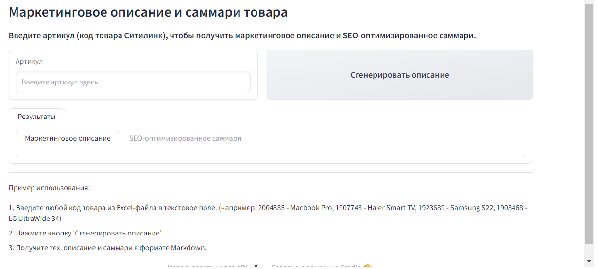

# Нейроконсультант
## Полуавтоматическая платформа для онлнайн-маркетплейсов
### Структура репозитория
Файлы соответствуют инструментам для сотрудника маркетплейса:
- [clever_search](https://github.com/KirpaDmitriy/aith/clever_search.py) - код инструмента для интеллектуального поиска по товарам
- [neuro_mentor](https://github.com/KirpaDmitriy/aith/neuro_mentor.py) - код инструмента для онбординга новых сотрудников
- [text_generation](https://github.com/KirpaDmitriy/aith/text_generation.py) - код инструментов для генерации описаний товаров и парсинга различных источников.

Скриншот приложения для генерации описания товаров:

### Окружение
Используются возможности облачной платформы [Yandex Cloud](https://yandex.cloud/ru/), особенно - возможности сервисов [Yandex DataSpere](https://datasphere.yandex.cloud) и [Yandex Compute Cloud](https://yandex.cloud/ru/services/compute).
В качестве операционной системы используется Ubuntu 22.04.

### Стек
- Python 3.10
- YandexGPT
- Gradio
- Streamlit

### Генерация текста по гетерогенным признакам
Товары на маркетплейсе - коллекция сущностей с неоднородными (гетерогенными признаками), которые пока что плохо поддаются нейронным сетям. Однако существует ряд подходов, помогающий решить возникающие проблемы. Некоторые из них были предложены участниками команды и являются уникальными на рынке. Со статьями на тему генерации текста по гетерогенным данным можно ознакомиться по ссылкам:
- https://habr.com/ru/companies/spbifmo/articles/787660/
- https://kmu.itmo.ru/digests/article/12896

Предлагаемые решения ориентировались на разработки в рамках https://github.com/KirpaDmitriy/boostformers/ и https://github.com/KirpaDmitriy/Podruchniy/.
